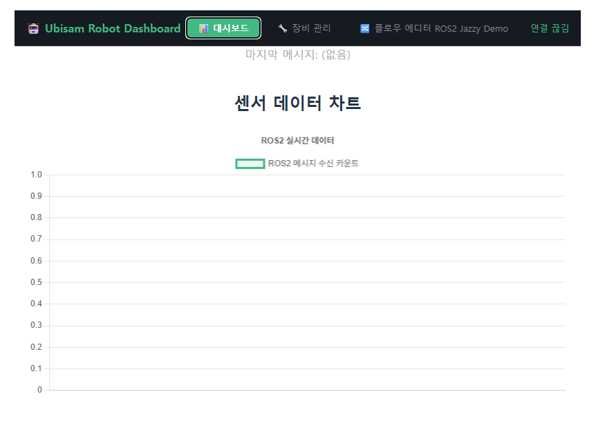
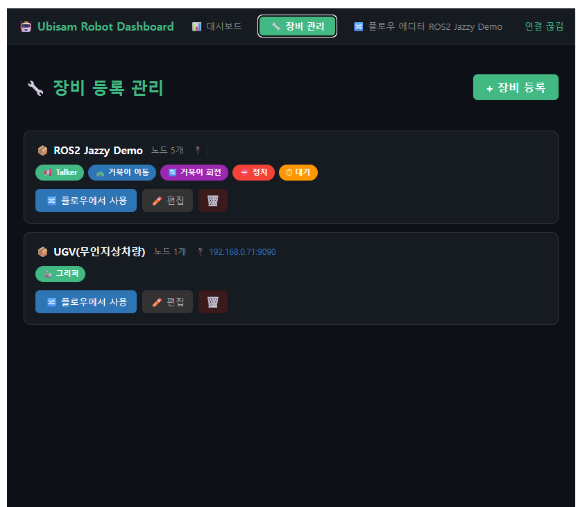
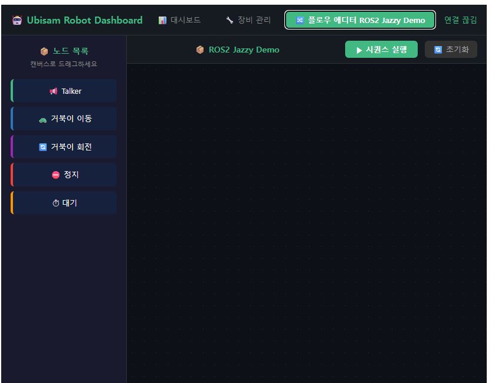
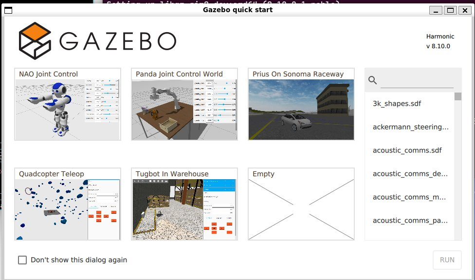
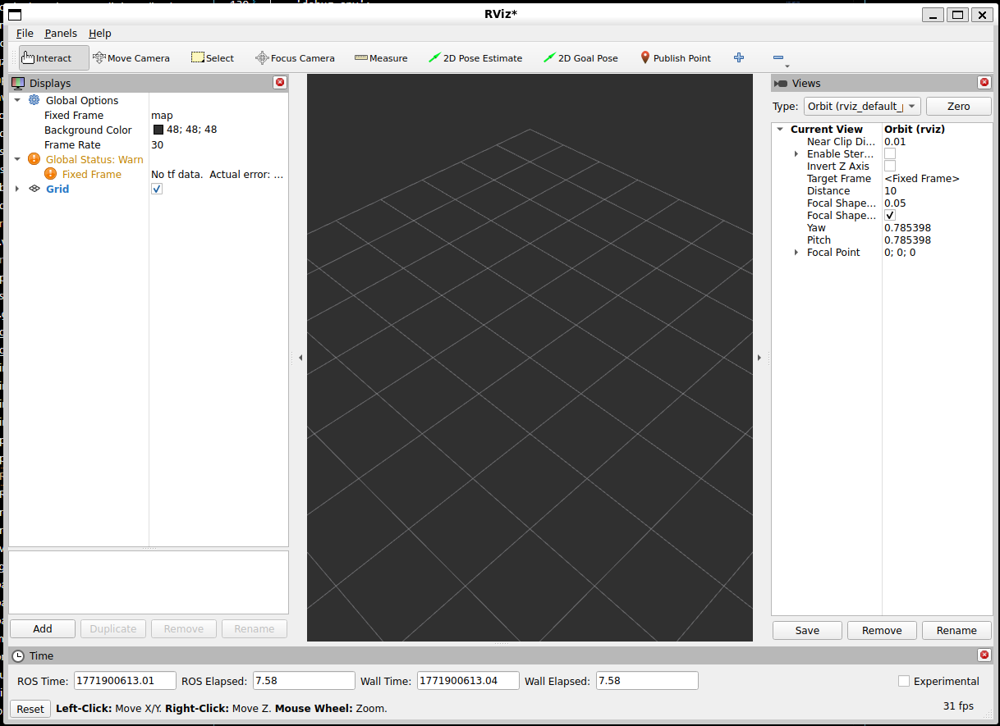

# Vue 3 + Vite

This template should help get you started developing with Vue 3 in Vite. The template uses Vue 3 `<script setup>` SFCs, check out the [script setup docs](https://v3.vuejs.org/api/sfc-script-setup.html#sfc-script-setup) to learn more.

Learn more about IDE Support for Vue in the [Vue Docs Scaling up Guide](https://vuejs.org/guide/scaling-up/tooling.html#ide-support).

[ROS2 Jazzy Guide]
(https://docs.ros.org/en/jazzy/).

# Git 레포지트리 연동 명령어 & 업데이트
작성일 2026-02-23
작성자 노도연

```bash

User@DESKTOP-CN4O63O MINGW64 //wsl.localhost/Ubuntu-24.04/home/ubisam/projects/ubisam_robot_ui (master)
$ cd 이동 ls 목록 확인 

$ git config --global --add safe.directory '//wsl.localhost/Ubuntu-24.04/home/ubisam/projects/ubisam_robot_ui'

$ git remote add origin https://github.com/NohDoyeon241104/Ubisam_Robot_Dashboard.git      

$ git add .

$ git commit -m "feat:Initial ROS2+ Vue3 Dashboard Setup"

$ git push -u origin master
```

# 금일 작업 내용 
작성일 2026-02-23
작성자 노도연




# 실행 테스트 
```
<!-- talker 실행 -->
source /opt/ros/jazzy/setup.bash
ros2 run demo_nodes_cpp talker
```

```
<!-- listener 실행 -->
source /opt/ros/jazzy/setup.bash
ros2 run demo_nodes_cpp listener
```


```
<!-- rosbridge 실행 -->
source /opt/ros/jazzy/setup.bash
ros2 launch rosbridge_server rosbridge_websocket_launch.xml
```

```
<!-- rqt_graph 실행 노드 통신 그래프 확인 가능  -->
rqt_graph
```

```
<!-- 터틀봇 실행  -->
source /opt/ros/jazzy/setup.bash
ros2 run turtlesim turtlesim_node
```

```
<!-- 터틀봇 실행  -->
source /opt/ros/jazzy/setup.bash
ros2 run turtlesim turtle_teleop_key
```

# Gazebo 환경 세팅 확인
```bash
# Gazebo 설치 확인
ros2 pkg list | grep gz

### 없으면 설치
### Gazebo 설치 확인
ros2 pkg list | grep gz

### 없으면 설치
sudo apt install ros-jazzy-ros-gz -y
```

# Gazebo 설치 확인 후 동작테스트 명령어 
```bash
ros2 launch ros_gz_sim gz_sim.launch.py

[ERROR] [launch]: Caught exception in launch (see debug for traceback): 'NoneType' object has no attribute 'lower'
```

### ERROR 원인 확인 중
```
echo $DISPLAY 
확인결과 :0  정상
WSL2에서 $DISPLAY=:0이면 WSLg(Windows 11의 내장 GUI 지원)를 사용하는 환경
```

```
ros2 launch ros_gz_sim gz_sim.launch.py --debug
printenv | grep -E "DISPLAY|WAYLAND|XDG|GZ|IGN"
확인 결과 :
WAYLAND_DISPLAY=wayland-0
DISPLAY=:0
XDG_RUNTIME_DIR=/run/user/1000/
XDG_DATA_DIRS=/usr/local/share:/usr/share:/var/lib/snapd/desktop
ubisam@DESKTOP-CN4O63O:~$
WSLg 환경 정상입니다. GZ 관련 환경변수가 없는 게 보이네요.
```

```launch 파일의 인자 목록을 보여주는 명령
ros2 launch ros_gz_sim gz_sim.launch.py -s

ubisam@DESKTOP-CN4O63O:~$ ros2 launch ros_gz_sim gz_sim.launch.py -s
Arguments (pass arguments as '<name>:=<value>'):

    'gz_args':
        Arguments to be passed to Gazebo Sim
        (default: '')

    'gz_version':
        Gazebo Sim's major version
        (default: '8')

    'ign_args':
        Deprecated: Arguments to be passed to Gazebo Sim
        (default: '')

    'ign_version':
        Deprecated: Gazebo Sim's major version
        (default: '')

    'debugger':
        Run in Debugger
        (default: 'false')

    'debug_env':
        Debug environment variables
        (default: 'false')

    'on_exit_shutdown':
        Shutdown on gz-sim exit
        (default: 'false')
```


### 이유 Gazebo 저장소 등록 안 된 상태여서 저장소 추가하고 설치진행할 것 

# 저장소 키 추가
sudo curl https://packages.osrfoundation.org/gazebo.gpg --output /usr/share/keyrings/pkgs-osrf-archive-keyring.gpg

# 저장소 등록
echo "deb [arch=$(dpkg --print-architecture) signed-by=/usr/share/keyrings/pkgs-osrf-archive-keyring.gpg] http://packages.osrfoundation.org/gazebo/ubuntu-stable $(lsb_release -cs) main" | sudo tee /etc/apt/sources.list.d/gazebo-stable.list > /dev/null

# 패키지 목록 업데이트
sudo apt update

# Gazebo Harmonic 설치
sudo apt install gz-harmonic -y

# 설치 후 확인 
gz sim --version

# 퀵스타트 시작하기 
ros2 launch ros_gz_sim gz_sim.launch.py


# 맵 선택 run과 아래 명령어로 맵 실행은 같은 것!  
source /opt/ros/jazzy/setup.bash
ros2 launch ros_gz_sim gz_sim.launch.py gz_args:="tugbot_in_warehouse.sdf"


실제 환경:  실제 로봇 → 센서 → ROS 토픽 → RViz
시뮬 환경:  Gazebo 로봇 → 가상 센서 → ROS 토픽 → RViz



Step 1 - Tugbot 월드 실행
터미널 1:
bashsource /opt/ros/jazzy/setup.bash
ros2 launch ros_gz_sim gz_sim.launch.py gz_args:="tugbot_in_warehouse.sdf"
실행 후 Gazebo 화면이 뜨면 터미널 출력이랑 화면 상태 알려주세요.
터미널 2 - 토픽 브릿지 연결
bashsource /opt/ros/jazzy/setup.bash
ros2 run ros_gz_bridge parameter_bridge \
  /scan@sensor_msgs/msg/LaserScan@gz.msgs.LaserScan \
  /odom@nav_msgs/msg/Odometry@gz.msgs.Odometry \
  /tf@tf2_msgs/msg/TFMessage@gz.msgs.Pose_V
터미널 3 - RViz 실행
bashsource /opt/ros/jazzy/setup.bash
rviz2
브릿지 실행 후 터미널

``` 각각 [ ] 부분이 연결 상태 
ubisam@DESKTOP-CN4O63O:~$ source /opt/ros/jazzy/setup.bash
ros2 run ros_gz_bridge parameter_bridge \
  /scan@sensor_msgs/msg/LaserScan@gz.msgs.LaserScan \
  /odom@nav_msgs/msg/Odometry@gz.msgs.Odometry \
  /tf@tf2_msgs/msg/TFMessage@gz.msgs.Pose_V
[INFO] [1771900725.520409066] [ros_gz_bridge]: Creating GZ->ROS Bridge: [/scan (gz.msgs.LaserScan) -> /scan (sensor_msgs/msg/LaserScan)] (Lazy 0)
[INFO] [1771900725.563940618] [ros_gz_bridge]: Creating ROS->GZ Bridge: [/scan (sensor_msgs/msg/LaserScan) -> /scan (gz.msgs.LaserScan)] (Lazy 0)
[INFO] [1771900725.565133036] [ros_gz_bridge]: Creating GZ->ROS Bridge: [/odom (gz.msgs.Odometry) -> /odom (nav_msgs/msg/Odometry)] (Lazy 0)
[INFO] [1771900725.572023587] [ros_gz_bridge]: Creating ROS->GZ Bridge: [/odom (nav_msgs/msg/Odometry) -> /odom (gz.msgs.Odometry)] (Lazy 0)
[INFO] [1771900725.573794055] [ros_gz_bridge]: Creating GZ->ROS Bridge: [/tf (gz.msgs.Pose_V) -> /tf (tf2_msgs/msg/TFMessage)] (Lazy 0)
[INFO] [1771900725.577412234] [ros_gz_bridge]: Creating ROS->GZ Bridge: [/tf (tf2_msgs/msg/TFMessage) -> /tf (gz.msgs.Pose_V)] (Lazy 0)
```